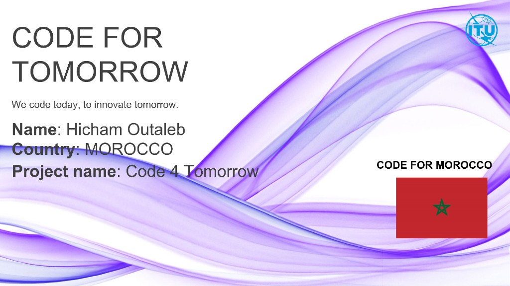
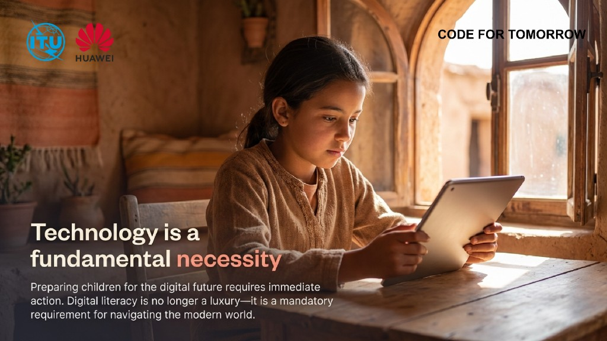
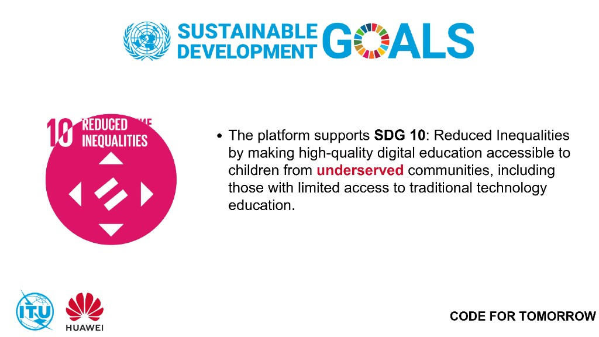
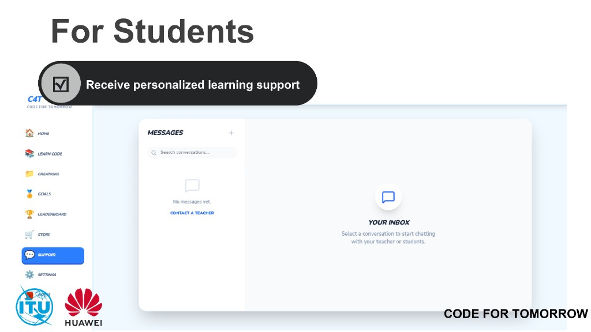
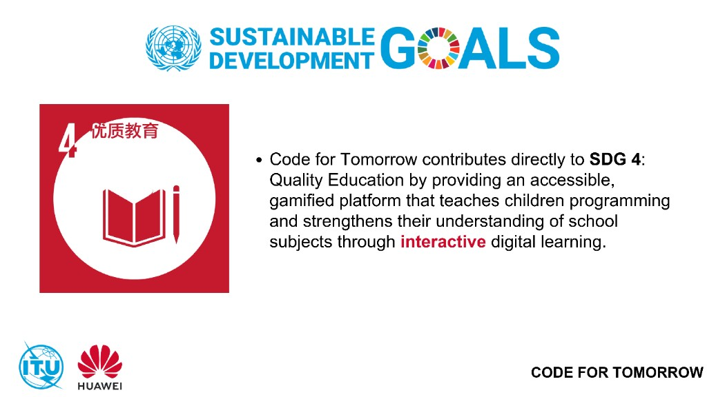
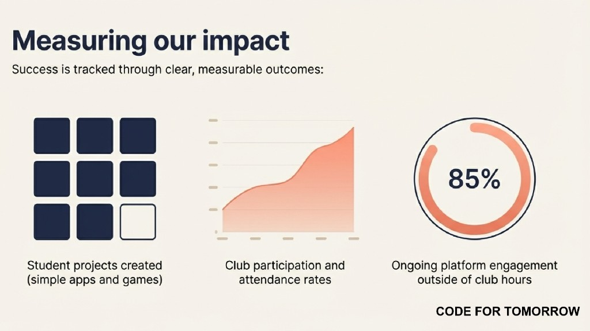

<div align="center">
  

  # Code for Tomorrow

  ### Bridging the digital divide in rural Morocco through AI-powered, inclusive education.

  [Vision](#vision) •
  [Features](#key-features) •
  [Impact](#impact-and-sdgs) •
  [Tech Stack](#tech-stack) •
  [Run Locally](#run-locally)
</div>

---

## Vision

Code for Tomorrow is a gamified EdTech platform that helps students (ages 8-15) build digital skills through interactive learning, while giving teachers practical tools to prepare lessons, activities, and assessments quickly.

Our mission is to establish sustainable coding clubs in underserved primary schools and make quality digital education accessible both online and offline.

<p align="center">
  
</p>

## Key Features

### For Teachers
- Prepare classroom activities in minutes
- Generate lesson plans instantly
- Create quizzes and exercises with AI support

<p align="center">
  
</p>

### For Students
- Receive personalized learning support
- Practice with AI-generated exercises
- Learn through gamified challenges and creative projects

<p align="center">
  
</p>

## Impact and SDGs

Code for Tomorrow directly contributes to:
- **SDG 4**: Quality Education
- **SDG 5**: Gender Equality
- **SDG 9**: Industry, Innovation and Infrastructure
- **SDG 10**: Reduced Inequalities

<p align="center">
  
</p>

### Measurable Outcomes
- Equip **200+ students annually** with coding and digital creativity skills
- Increase participation through project-based, engaging learning
- Enable schools to run coding programs with limited infrastructure

<p align="center">
  
</p>

## Media

<p align="center">
  
  
</p>

## Tech Stack

- **Frontend**: React, Vite, Tailwind CSS, React Router, Three.js
- **Backend**: Node.js, Express
- **AI**: Google Gemini (`@google/genai`)
- **Database**: MongoDB + Mongoose
- **Auth & Security**: Google OAuth, JWT, bcrypt, rate limiting
- **Analytics**: PostHog
- **Testing**: Vitest, Playwright, Testing Library

## Run Locally

**Prerequisites:** Node.js

1. Install dependencies:
   ```bash
   npm install
   ```
2. Create a local env file and set your key:
   ```bash
   cp .env.example .env.local
   ```
   Add your `GEMINI_API_KEY` in `.env.local`.
3. Start the app:
   ```bash
   npm run dev
   ```

## Project Mission

Technology should be a basic necessity, not a privilege.  
Code for Tomorrow empowers rural communities with future-ready skills so every child can create, innovate, and thrive in a digital world.
